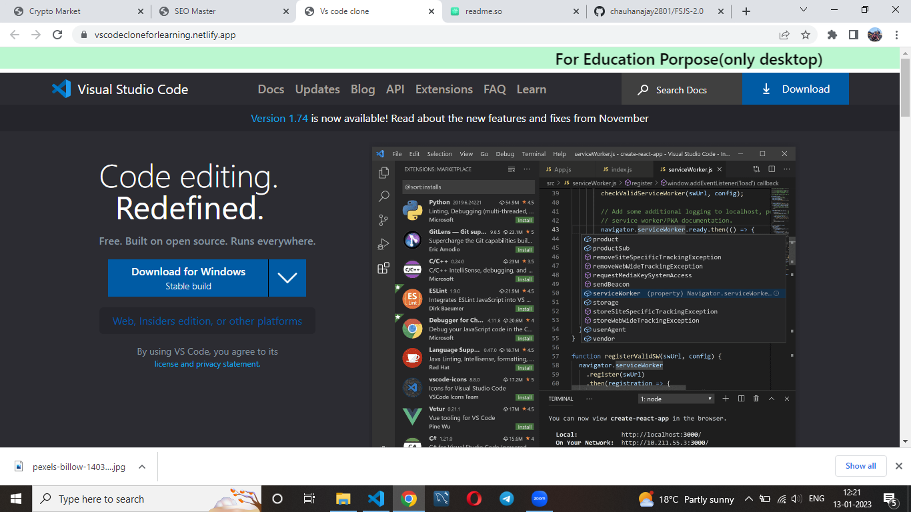

# Vscode Clone

This project is made by using html,tailwind css.
It used many different images flexbox, grid and different css properties.

## Screenshots

[Preview](https://vscodecloneforlearning.netlify.app/)