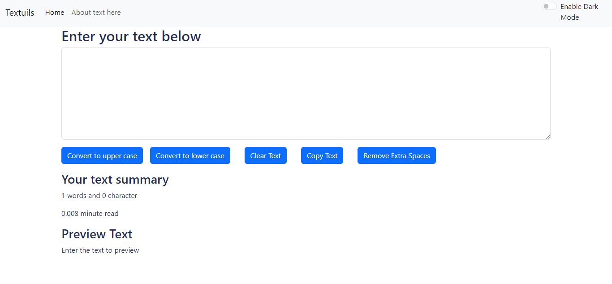
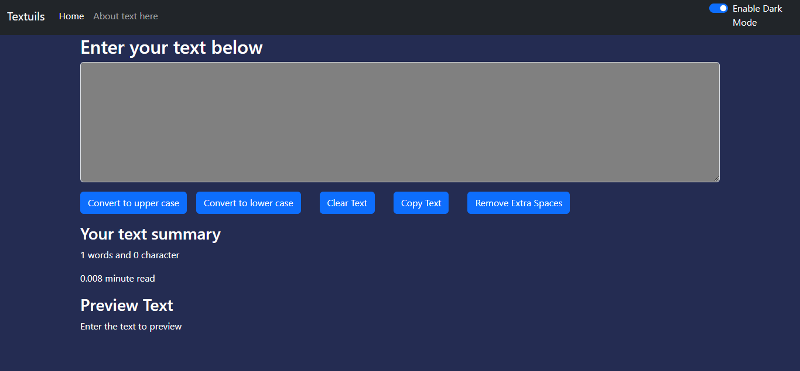

# Working of first react app
## This project used react and bootstrap. It does several operations on the text 
## The webapp has various features like
### 1. removing the extra spaces   
### 2. coverting the text into lower case 
### 3. converting the text into uppercase 
### 4. copying the text to clipboard 
### 5. clearing the text 
### 6. provides the average reading time  
### 7. giving the info about the characters and the words 
### 8. dark mode which can turn the app into dark or light mode 

## Screenshots

# Preview of website -------click below 
[Preview the website(click here)](https://textutilityapp1.netlify.app/)